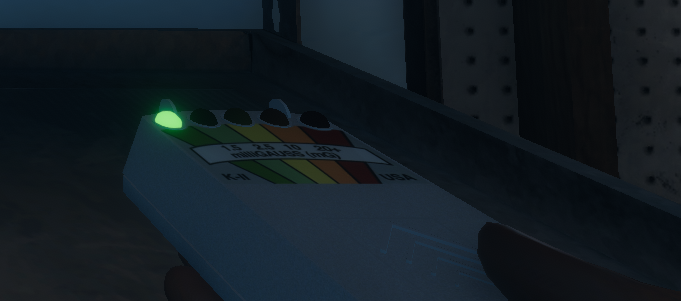
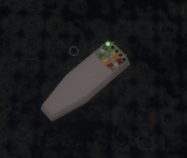

# EMF Reader

It tells you if there has been some recent ghost activity nearby such as the ghost itself or if the ghost touched something.

## Evidence

Whenever the EMF Reader reaches the maximum level (5) that is a form of evidence.

**You do not need to take a photo of it for evidence.**

## Tips

- turn the device on and keep it on your waist to always track ghost movement
- if you have an optional objective to reach level 5 on the EMF reader you can leave it in the house and it might accidentally complete it for you

## Images

