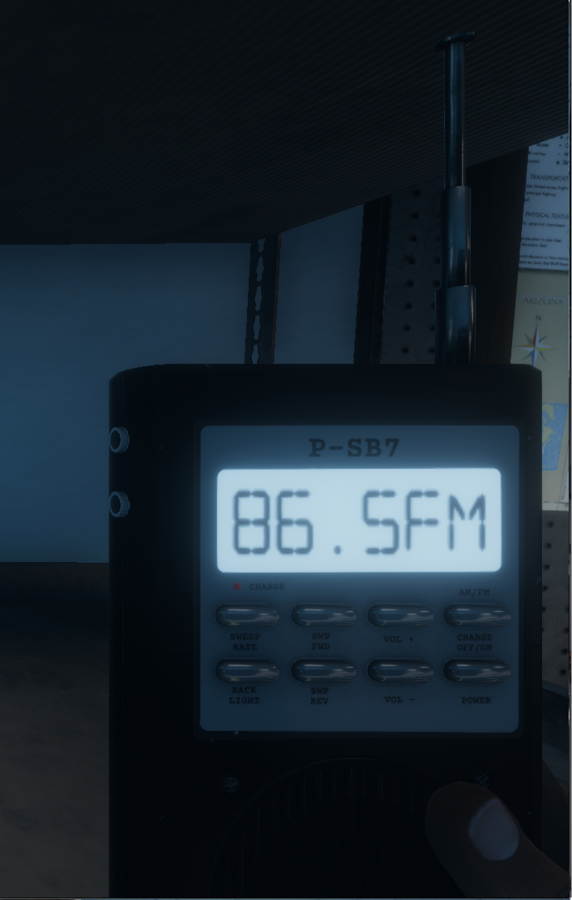
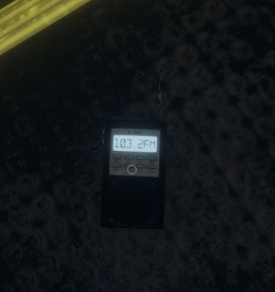

# Spirit Box

**Evidence: Yes**

This item is used to talk to the ghost. Turn it on and ask it questions like "are you there" and if it gives you a 1 word answer like "kill" or "yes" or "die" or something then you have found that evidence.

## Notes

You can either talk to it when it is near your or talk to it inside the haunted room.

Ensure the lights are turned off to get a response.

You do not need to take a photo of the Spirit Box for the evidence to count.

## What should I ask it?

Technically it can give you hints about itself and what to do to defeat it however in most cases just getting a response is enough. You can leave the Spirit Box anywhere and move on with the game.

You can ask it a variety of questions such as:

- "Are you there?"
- "Can we leave?"
- "Give us a sign"

## With voice detection

You can test if your voice detection is working by turning on the spirit box and asking "are you there". If it the ghost responds or says "Nothing Detected" on the device then it is working.

**Ensure you have not alt-tabbed from the game and that you have clicked on the game window so that voice detection works!**

## Without voice detection

Say anything into your mic and (if the ghost heard you) it will give you a random response

## Images

